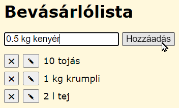
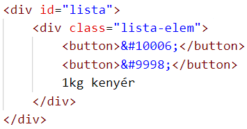

# Bevásárlólista

Ebben a feladatban egy bevásárlólistát készítünk.

Új tételt a szöveges mezőbe kell beírni, majd a rögzítéshez meg kell nyomni az <kbd>Enter</kbd> billentyűt, vagy rá kell kattintani a Hozzáadás gombra.

Egy tételt a listában az X gombbal lehet törölni, a ceruza gombra kattintva pedig szerkeszteni.

Az új és a szerkesztett tételek a lista végére kerülnek.

A lista az oldal frissítékor vgay újra megnyitásakor sem törlődik. Az adatokat a böngészőben (LocalStorage) tároljuk.

## Repository kezelése

1. Klónozd ezt a repository-t a saját számítógépedre és a továbbiakban ennek *vasarlas* mappájában dolgozz!

1. Töltsd fel a repository-t egy új repository-ba a saját GitHub fiókodba! A továbbiakban is töltsd fel ide a commitokat!

## Feladatok a HTML fájlban

1. Az oldal lapfülön megjelenő címe legyen Bevásárlólista! Ez a cím jelenjen meg első szintű címsorként is az oldal tetején!

1. A szöveges beviteli mező és a gomb egy formon helyezkedjen el! A szöveges mező azonosítója legyen "uj-elem", és az oldal betöltődésekor automatikusan kerüljön rá a kurzor! A gomb submit típusú legyen!

1. A form után legyen egy üres szakasz (div) "lista" azonosítóval! Ebbe kerülnek majd a bevitt elemek.

1. KApcsold az oldalhoz a styles.css stílusfájlt és az app.js szkriptet!

1. Commitold a módosításokat!

## Feladatok a CSS fájlban

1. Az oldal körül legyen 1 rem nagyságú belső margó! Háttere cornsilk színű legyen! A betűtípust állítsd Verdana-ra vagy talpatlanra!

1. A form margói felül és alul 1rem, két oldalon pedig 0 méretűek legyenek!

1. A formon lévő szöveges mező betűmérete 1.1rem legyen!

1. A lista margói felül és alul 0.5rem, két oldalon pedig 0 méretűek legyenek! A betűmérete 1.1rem legyen!

1. Készíts egy osztályt a listaelemeknek "lista-elem" néven! Ebben állítsd be, hogy a margók felül és alul 0.5rem, két oldalon pedig 0 méretűek legyenek!

1. A "lista-elem" osztályú elemek belsejében lévő gombok betűmérete 1rem, jobb oldali margója 0.5rem legyen!

1. Commitold a módosításokat!

## Feladatok a JS fájlban

1. Készíts egy-egy állandót az oldal főbb elemeinek:  
form - úrlap,  
ujelem - "uj-elem" azonosítójú elem  
lista - "lista" azonosítójú elem

1. Egy új elemnek így kell megjelennie a HTML kódban:  
  
Készíts egy *letrehoz* nevű függvényt, amely a lista HTML kódjához hozzáfűzi egy ilyen elem kódját! Az elem nevét paraméterként kapja meg a függvény! Próbáld ki a függvényt a konzolról!

1. Készíts egy eseménykezelőt a form submit eseményéhez! Ez akkor következik be, amikor megnyomjuk a Hozzáad gombot vagy az <kbd>Enter</kbd> billentyűt. Az eseménykezelő egy paraméterben kapja meg az esemény részleteit. Nevezd ezt e-nek!

1. A submit gomb megnyomásakor az oldal automatikusan újratöltődik. Akadályozd meg ezt az eseménykezelőben!

1. Úres elemeket nem szeretnénk hozzáadni a listához. Üres szövegmező esetén az eseménykezelő fejezze be a működését!

1. Az eseménykezelő hívja meg a betolt függvényt a szöveges mezőbe írt szöveggel!

1. Az új elem felvétele után a szöveges mező törlődjön, és kerüljön rá a kurzor! Próbáld ki az adatok bevitelét a böngészőben!

1. Készíts egy *torol* nevű függvényt, amely paraméterként kapja meg a törlendő elem gyermek elemét, és eltávolítja azt az oldalról! A törlés után kerüljön a szövegmezőre a fókusz!

1. Egészítsd ki a *letrehoz* függvényt úgy, hogy az új elem első gombja hívja meg a függvényt az adott elemmel! Próbáld ki a töröl gomb működését!

1. Készíts egy *szerkeszt* nevű függvényt, amely paraméterként kapja meg a szerkesztendő elem gyermek elemét! A szerkesztéshez másolja az elem szövegét a szövegmezőbe és távolítsa el az elemet a listából!

1. Egészítsd ki a *letrehoz* függvényt úgy, hogy az új elem második gombja hívja meg a *szerkeszt* függvényt az adott elemmel! Próbáld ki a szerkeszt gomb működését!

1. Az oldal frissítésekor újratöltésekor is szeretnénk megőrizni a lista tartalmát. Ehhez készíts egy *ment* nevű függvényt, amely elmenti a lista teljes tartalmát a böngésző helyi tárolójába (Local storage-ba)! Próbáld ki a mentést a böngésző konzoljáról! Ellenőrizd a Local storage tartalmát!

1. Készíts egy *betolt* nevű függvényt, amely betölti a listába a Local storage lista kulcsához tartozó szöveget! Ha nincs lista mevű kulcs, akkor üres legyen a lista!

1. Az oldal betöltésekor hívja meg a *betolt* függvényt!

1. Commitold a módosításokat!

## Publikálás

1. Publikáld az oldalt a GitHubon!

1. Próbáld ki a böngészőben és mobilon is a működését!